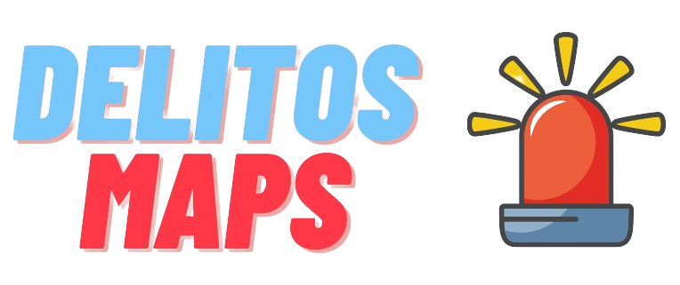

  

## 📋 Tema Integrador
DelitosMaps se trata de um projeto de desenvolvimento para a conclusão de curso de Sistemas para Internet do IFB- Instituo Federal de brasília, a sua ideia central é ser uma ferramenta  de mapeamento criminal com a missão de auxiliar a segurança pública com informação e tecnologia, unindo a iniciativa popular e a administração pública.
O sistema tem como principal funcionalidade o mapeamento dos crimes por meio de um registro da vítima, relatando os dados do ocorrido e marcando o local no mapa, gerando dessa forma um insumo de delitos visíveis e traduzidos para a população geral que irá se informar e se prevenir evitando transitar em locais com maior incidência de crimes.

## ✔️ Motivação
Altos índices de criminalidade de Planaltina DF.
## 🎯 Visão de Negócio
• Democratização das informações sobre a criminalidade na região de Planaltina. 
• Uma possível solução de prevenção de novas vítimas de crimes. 
• Aproximação populacional de órgãos de segurança pública tomada de medidas de políticas públicas sobre esse problema. 
• Descentralização de dados criminais pela sub-secretaria de Gestão da Informação do SSP-DF, possibilitando nova alternativa para levantamento de dados criminais. 
• Novo canal de consulta social para crimes, visto que, atualmente essas informações residem em uma planilha de Excel no site da SSP-DF, de forma pouca amigável para pessoas comuns. 
• Ferramenta de estudo analítico para gerar nvoas investigações, protocolar patrulhamento e tomar medidas por parte da administração pública. 
## 💻 Ambiente de Desenvolvimento
<b>Spring Tool Suite</b> - O Spring Tool Suite é uma IDE baseada em Eclipse que dá algumas facilidades para trabalhos com o Spring no geral. Uma das coisas legais é que ele nos ajuda a criar projetos com Spring Boot.
<b>Visual Studio Code</b> - O Visual Studio Code (VS Code) é um editor de código de código aberto desenvolvido pela Microsoft. A saber, ele está disponível para Windows, Mac e Linux. É criado com Electron, ferramenta criada pelo GitHub que permite a criação de softwares Desktop com HTML, CSS e JavaScript.

  

## 🔧 Ferramentas para o Desenvolvimento
Front-End
## 👨‍💻 Integrantes
Guilherme Henrique Oliveira Sotério
## 💡 Soluções para o Problemas Identificados
## 🧑‍💻 Linguagens de Programação
Java, Javascript, SQL.
## 📝Tecnologias
<b>ReactJs</b> -
<b>MomentJs</b> -
<b>ReactHooks</b> -
<b>Leaflet</b> -
<b>React-Router-Dom</b> -
<b>SpringBoot</b> - O Spring Boot é um projeto da Spring que veio para facilitar o processo de configuração e publicação de nossas aplicações. Ele foi a principal framework utilizada no desenvolvimento  da arquitetura backend para a criação da API, rotas, controlador, model.
<b>SpringJPA</b> -
<b>PostgresSQL</b> -

