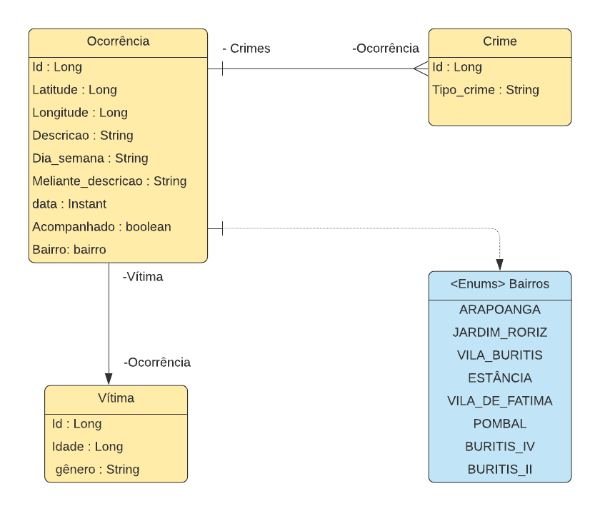
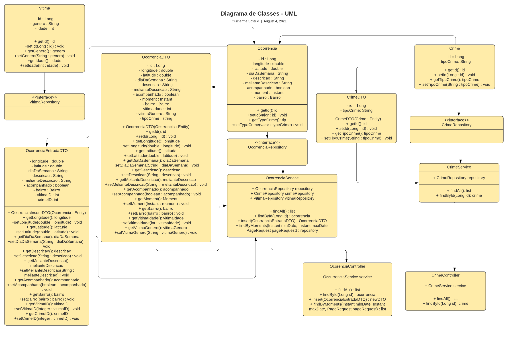
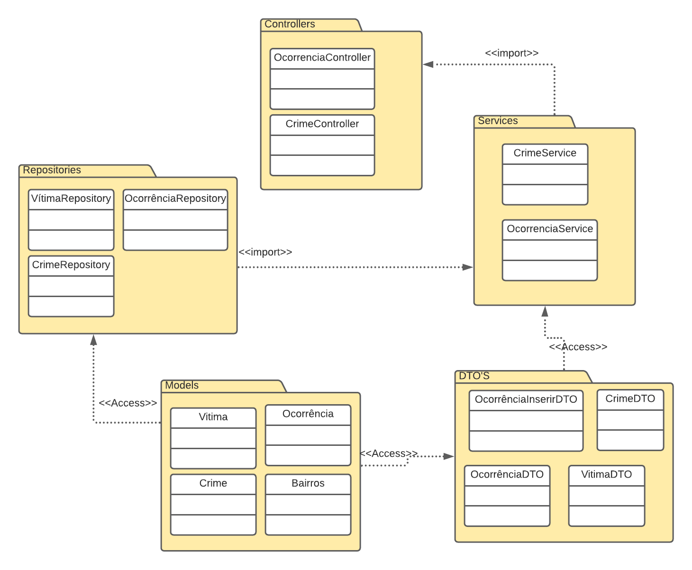
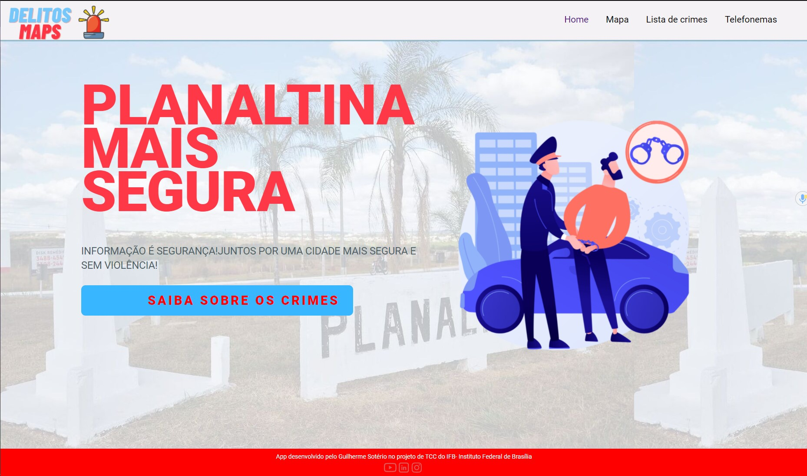
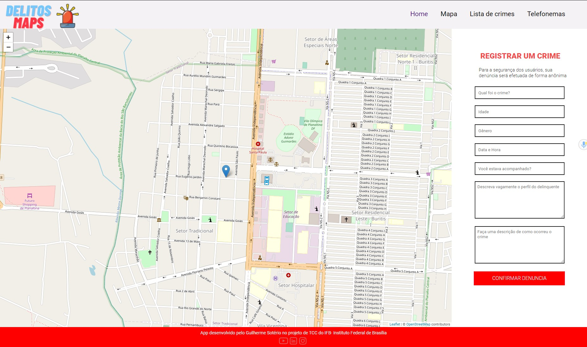
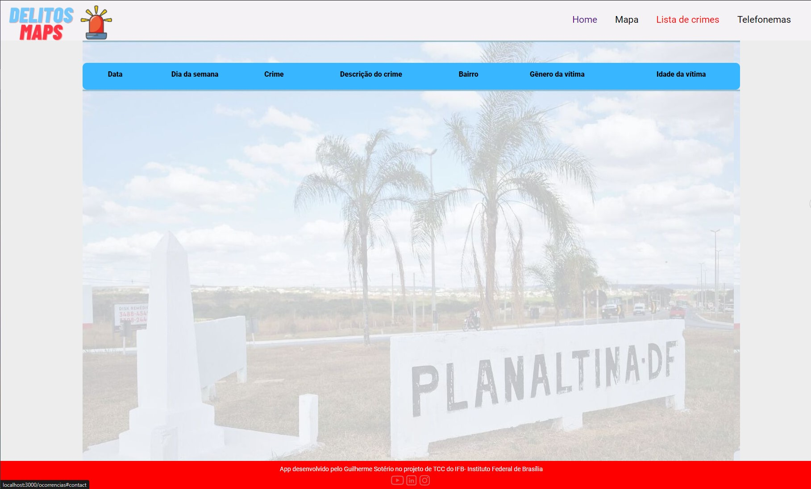
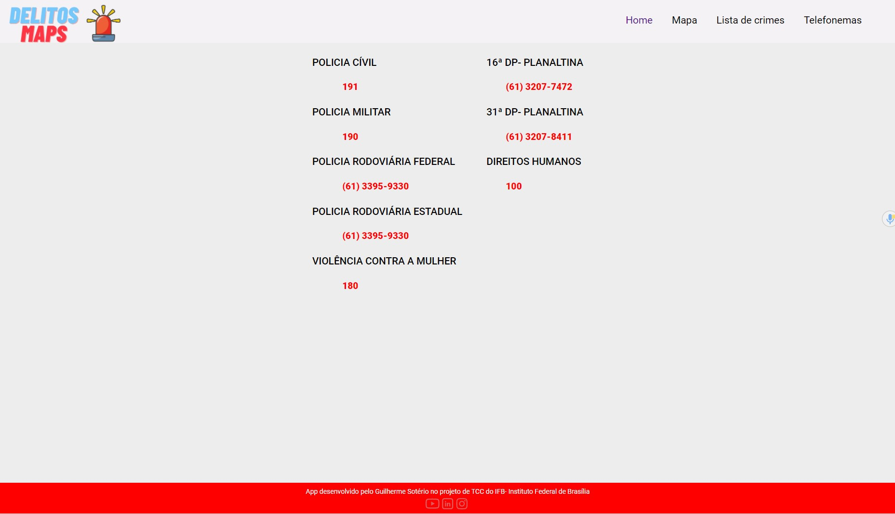

  

## 📋 Tema Integrador
DelitosMaps se trata de um projeto de desenvolvimento para a conclusão de curso de Sistemas para Internet do IFB- Instituo Federal de brasília, a sua ideia central é ser uma ferramenta  de mapeamento criminal com a missão de auxiliar a segurança pública com informação e tecnologia, unindo a iniciativa popular e a administração pública.
O sistema tem como principal funcionalidade o mapeamento dos crimes por meio de um registro da vítima, relatando os dados do ocorrido e marcando o local no mapa, gerando dessa forma um insumo de delitos visíveis e traduzidos para a população geral que irá se informar e se prevenir evitando transitar em locais com maior incidência de crimes.

## ✔️ Motivação
• Altos índices de criminalidade de Planaltina DF. 
• Ausência de um sistema de mapeamento de crimes estritamente local que foque no registro das vítimas. 
• Falta de legibilidade da página de crimes fornecida pelo site oficial do SSP-DF. 
## 🎯 Visão de Negócio
• Democratização das informações sobre a criminalidade na região de Planaltina. 
• Uma possível solução de prevenção de novas vítimas de crimes. 
• Aproximação populacional de órgãos de segurança pública tomada de medidas de políticas públicas sobre esse problema. 
• Descentralização de dados criminais pela sub-secretaria de Gestão da Informação do SSP-DF, possibilitando nova alternativa para levantamento de dados criminais. 
• Novo canal de consulta social para crimes, visto que, atualmente essas informações residem em uma planilha de Excel no site da SSP-DF, de forma pouca amigável para pessoas comuns. 
• Ferramenta de estudo analítico para gerar nvoas investigações, protocolar patrulhamento e tomar medidas por parte da administração pública. 
## 💻 Ambiente de Desenvolvimento
<b>Spring Tool Suite</b> - O Spring Tool Suite é uma IDE baseada em Eclipse que dá algumas facilidades para trabalhos com o Spring no geral. Uma das coisas legais é que ele nos ajuda a criar projetos com Spring Boot. 
<b>Visual Studio Code</b> - O Visual Studio Code (VS Code) é um editor de código de código aberto desenvolvido pela Microsoft. A saber, ele está disponível para Windows, Mac e Linux. É criado com Electron, ferramenta criada pelo GitHub que permite a criação de softwares Desktop com HTML, CSS e JavaScript.

  
  

## 🔧 Ferramentas para o Desenvolvimento
<b>Front-End-</b> É o escopo de desenvolvimento das interfaces da aplicação, nesse segmento foi utilizado o framework React, que fornece dentre varios benefícios a SPA- single Page Application, e a componentização de códigos que podem ser reutilizados. 

<b>Back-End-</b> Já o backend é o segmento do escopo que lida com o tratamento de dados, modela e cria a lógica da programação, essa parte não é visível para o cliente, essa parte foi construída com a linguagem Java com o framework SpringBoot. 

<b>Banco de Dados- </b> O banco de dados permite o armazenamento de praticamente qualquer tipo de dado. Velocidade e custo relativamente baixo o tornou popular entre as organizações com grandes bases de clientes. Nessa aplicação foi utilizado o sistema de gerenciamento de banco de dados: PostgresSQL  

<b>Versionamento de Código- </b> O versionamento de código é possível saber sempre que uma alteração for realizada, quem a fez e o porquê. Esse controle é fundamental para a organização e a segurança do projeto, evitando que aconteçam falhas no processo. Para esse objetivo foi utilizado o próprio github que aqui se encontra.  

<b>Biblioteca de testes- </b> Os testes de software na prática são realizados para garantir que o usuário do produto poderá ter segurança em utilizar o sistema mesmo em situações de grande estresse para o software. 

<b>Deploy da aplicação- </b> Um deploy, em termos práticos, significa colocar no ar alguma aplicação que teve seu desenvolvimento concluído, esse doploy foi realizado pelo serviço Heroku no link que segue a seguir: .   

<b>Documentação UML- </b> UML é uma linguagem para visualização, especificação, construção e documentação de artefatos de um software em desenvolvimento.  

<b>Documentação da API</b> A documentação permite que desenvolvedores tenham uma visão mais clara do seu produto e de como o seu código pode funcionar em conjunto com o software deles. Para esse objetivo foi utilizado o framework Swagger, focado nesse objetivo.  

## 👨‍💻 Integrantes
Guilherme Henrique Oliveira Sotério  

## 💡 Soluções para o Problemas Identificados
### -Documentação da API
Link da documentação da API construída com o Swagger:
https://app.swaggerhub.com/apis/delitosmaps/DelitosMaps/0.1#/default/get_occurrences 

### -Documentação UML da Arquitetura do Sistema:

### Diagrama de Entidades:

  

### Diagrama de Classes:

  

### Diagrama de Pacotes:

  

### -Interfaces criadas:

### Página Home

  

### Página de Mapeamento de Crimes

  

### Página de Listagem de Crimes

  

### Página de Telefonemas

  

## 🧑‍💻 Linguagens de Programação
Java, Javascript, SQL.

## 📝Tecnologias
<b>ReactJs -</b> React. js é usada para lidar com a camada de visualização para aplicações web e móveis, e permite também criar componentes de UI reutilizáveis, além de gerar o SPA- Single Page Application.  

<b>MomentJs -</b> O MomentJS é uma biblioteca JavaScript muito poderosa, que fornece todo tipo de métodos e funções já prontinhas para lidar com o tempo em si.  

<b>ReactHooks -</b> React Hook é uma feature que permite que você use estado e outras features do React sem ter a necessidade de escrever uma classe. Com React Hook você vai poder: Utilizar estado em funções que são componentes.  

<b>Leaflet -</b>Leaflet é a biblioteca JavaScript de código aberto líder para mapas interativos compatíveis com dispositivos móveis.  

<b>React-Router-Dom -</b> O React Router é uma lib completa para controle de rotas que permite que você consiga configurar as rotas utilizando o formato JSX e também disponibiliza uma API para você configurar diretamente via Javascript.  

<b>SpringBoot -</b> O Spring Boot é um projeto da Spring que veio para facilitar o processo de configuração e publicação de nossas aplicações. Ele foi a principal framework utilizada no desenvolvimento  da arquitetura backend para a criação da API, rotas, controlador, model.  

<b>SpringJPA -</b> O Spring Data JPA é um framework que facilita a criação de repositórios liberando de ter que implementar as interfaces referentes aos nossos repositórios. 

<b>PostgresSQL -</b> PostgreSQL Database Server é um sistema de banco de dados poderoso e em código aberto para Windows, Mac e Linux. Ele possui mais de 15 anos de desenvolvimento ativo e uma arquitetura que ganhou uma forte reputação devido a sua estabilidade e integridade de dados.  

<b>Postman -</b> O Postman é um API Client que facilita aos desenvolvedores criar, compartilhar, testar e documentar APIs. Ele foi utilizado com essa finalidade de testar, rodando no modo de testes e no modo de produção.  

<b>Junit -</b> unit é um framework simples para escrever testes repetíveis automatizados com suporte na linguagem de programação Java. Com o Junit podemos criar testes para verificar funcionalidades de classes e seus métodos. No desenvolvimento desse projeto foram criadas funções para testar os repositórios.  

<b>Swagger -</b> O Swagger é uma aplicação open source que auxilia desenvolvedores nos processos de definir, criar, documentar e consumir APIs REST.  

